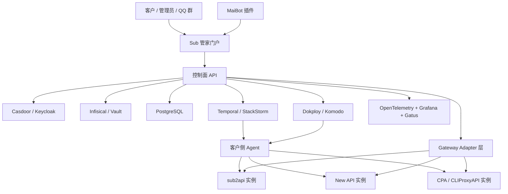

# Sub 管家平台架构建议书

日期：2026-07-01

## 1. 背景与目标

当前项目以 sub2api 为核心，承担 API 服务网关、账号池调度、模型兼容和上游聚合能力。生产容器部署后仍会遇到偶发报错、账号异常、上游不可用、Token 失效、映射配置误改、代理质量波动等问题，带来排错、清理错误账号、重新授权和客户沟通成本。

计划打造的“Sub 管家”不建议定位为单纯的聊天机器人或 Agent，而应定位为：

> 面向 AI API 网关生态的集成运维托管控制面，统一托管 sub2api、New API、CPA/CLIProxyAPI 等实例，提供服务部署、实例观测、号池自助管理、故障处置和上游自动切换能力。

本建议书遵循以下原则：

- 尽可能复用成熟开源框架，降低基础设施开发和排错成本。
- 不重写 sub2api、New API、CPA 的核心网关能力，优先通过适配器集成。
- 平台核心价值放在多实例托管、统一运维、号池策略、自动处置、审计和客户服务自动化。
- AI 负责分析、归因、建议和问答，不直接绕过策略执行高风险动作。

## 2. 接入系统范围

### 2.1 sub2api

仓库：https://github.com/Wei-Shaw/sub2api

定位：

- 多平台 AI API 网关。
- 支持账号、分组、模型映射、订阅、OpenAI/Gemini/Claude/Antigravity 等能力。
- 当前 fork 已有 Ops 监控、错误日志、告警、账号测试、批量清错、账号刷新等运维基础。

平台集成重点：

- 读取 Ops 错误和指标。
- 读取账号、分组、模型映射、调度状态。
- 执行账号测试、清错、刷新、隔离、恢复调度。
- 根据错误类型自动匹配 Runbook。
- 在客户授权下统一部署、升级和备份。

### 2.2 New API

仓库：https://github.com/QuantumNous/new-api

定位：

- One API / New API 体系的 AI 网关、渠道管理、令牌管理、用户与计费系统。
- 适合管理标准 API Key 渠道、模型倍率、用户令牌和用量统计。

平台集成重点：

- 读取渠道、模型、令牌、用户用量。
- 管理渠道启停、优先级、倍率和健康检查结果。
- 对接 New API 的管理接口或数据库只读镜像。
- 尽量通过 API/Adapter 集成，避免直接深度 fork。

注意：

- New API 常见许可证为 AGPLv3，若修改源码并对外提供网络服务，需要认真处理开源义务。
- 更稳妥的商业化路线是“外部托管控制面 + API 适配器”，而不是直接把 New API 深改成闭源产品。

### 2.3 CPA / CLIProxyAPI

暂按 CLIProxyAPI 体系理解：

- 主项目：https://github.com/router-for-me/CLIProxyAPI
- 管理中心：https://github.com/router-for-me/Cli-Proxy-API-Management-Center

定位：

- 将 CLI/OAuth 类账号能力包装成 OpenAI、Gemini、Claude 等兼容 API。
- 适合托管 Claude Code、Gemini CLI、Codex、OAuth 登录类账号和本地会话能力。

平台集成重点：

- 读取账号状态、CLI/OAuth 会话状态、代理状态、模型可用性。
- 执行重登、刷新、禁用、恢复、切换代理等动作。
- 接入 Management Center 或其 API，避免从零实现管理面。

若实际 CPA 指另一个项目，需要在后续调研中替换适配器，但整体控制面架构保持不变。

## 3. 推荐总体架构



核心思想：

- 控制面负责多租户、权限、实例、策略、工单、审计和编排。
- 客户侧 Agent 负责本地采集、执行和密钥隔离。
- Adapter 层负责屏蔽 sub2api、New API、CPA 的差异。
- Temporal 负责可靠执行、审批、重试、回滚和长流程状态。
- Dokploy/Komodo 负责服务部署和容器管理。
- OpenTelemetry/Gatus/Grafana 负责观测。
- MaiBot 负责 QQ 群答疑、状态查询、通知和审批入口。

## 4. 架构分层

### 4.1 控制面 API

建议自研，因为这是平台的业务核心。

推荐技术：

- Go + Gin/Fiber
- PostgreSQL
- Redis
- Ent/GORM/SQLC 任选，但建议和 sub2api 技术栈保持接近
- OpenAPI 文档

控制面职责：

- 租户管理
- 实例管理
- 服务部署记录
- 账号资产与号池抽象
- 路由策略
- 工单与事故管理
- 审批流
- 操作审计
- Runbook 管理
- 计费和套餐
- MaiBot / Webhook / API 对外入口

控制面不要做：

- 不直接代理所有用户业务流量，至少第一阶段不要。
- 不直接保存所有客户账号明文 Token。
- 不直接操作客户数据库。
- 不绕过 Adapter 调用某个系统的私有实现。

### 4.2 客户侧 Agent

客户侧 Agent 是部署在客户服务器或容器网络中的小程序。

推荐技术：

- Go 优先，单二进制、资源占用低、部署简单。
- Python 可用于快速实验，但生产 Agent 推荐 Go。

Agent 职责：

- 主动连接控制面，避免客户暴露管理端口。
- 定时采集实例健康、版本、日志摘要、账号状态。
- 接收控制面下发的任务。
- 调用本地 sub2api/New API/CPA 管理接口。
- 做本地脱敏和密钥隔离。
- 上报执行结果和心跳。

典型通信方式：

- HTTPS long polling
- WebSocket
- gRPC stream
- NATS/MQTT，可选

推荐先用 HTTPS long polling 或 WebSocket，降低部署复杂度。

### 4.3 Gateway Adapter 层

Adapter 是 Sub 管家的关键抽象层。

统一接口建议：

```text
GetInstanceInfo()
GetHealth()
ListAccounts()
ListChannels()
ListPools()
ListModels()
ListRecentErrors()
TestAccount(account_id)
ClearAccountError(account_id)
RefreshCredential(account_id)
SetAccountStatus(account_id, status)
SetChannelStatus(channel_id, status)
ApplyRoutePolicy(policy)
BackupConfig()
RestoreConfig(snapshot_id)
GetUsageSummary(range)
```

不同系统映射：

| 统一能力 | sub2api | New API | CPA/CLIProxyAPI |
|---|---|---|---|
| 账号 | Account | Channel / Token / User | OAuth/CLI Session |
| 号池 | Group / AccountGroup | Channel group / model routing | Account group / session pool |
| 错误 | Ops Error Logs | Logs / Channel error | Runtime logs |
| 测试 | Account Test | Channel Test | Session probe |
| 清错 | Clear Error | Enable/Reset channel | Reset error state |
| 刷新 | OAuth Refresh | Key/channel refresh | OAuth/CLI reauth |
| 路由 | Group/model mapping | Model/channel priority | Upstream session selection |

Adapter 先做读多写少，逐步增加写操作。

### 4.4 工作流层

推荐主选 Temporal。

仓库：https://github.com/temporalio/temporal

适合场景：

- 自动处置流程。
- 等待人工审批。
- 网络失败后重试。
- 执行后观察恢复。
- 失败回滚。
- 每一步都保留历史。

典型工作流：

```text
收到告警
→ 收集证据
→ 判断影响范围
→ AI 归因
→ 匹配 Runbook
→ 风险分级
→ 自动执行或等待审批
→ 执行动作
→ 验证结果
→ 成功关闭或升级人工
```

可选辅助框架：

- StackStorm：https://github.com/StackStorm/st2
- Rundeck：https://github.com/rundeck/rundeck
- Windmill：https://github.com/windmill-labs/windmill

选型建议：

- 如果要做 SaaS 产品核心流程，优先 Temporal。
- 如果想快速接告警和 ChatOps，可用 StackStorm 做辅助。
- 如果面向人工运维剧本，可接 Rundeck。
- 如果团队偏脚本和内部工具，可评估 Windmill。

### 4.5 部署层

不要从零写 PaaS。

推荐优先级：

1. Dokploy：https://github.com/Dokploy/dokploy
2. Komodo：https://github.com/moghtech/komodo
3. Portainer：https://github.com/portainer/portainer

建议：

- 第一版用 Dokploy 提供标准部署模板。
- 第二版接 Komodo 托管多 VPS、多 Docker Compose 栈。
- Portainer 可作为高级客户已有环境的兼容选项。

标准部署模板：

```text
sub2api + PostgreSQL + Redis + Caddy/Traefik
New API + MySQL/PostgreSQL + Redis
CPA/CLIProxyAPI + Management Center + 配置卷
Agent sidecar
OpenTelemetry Collector sidecar
```

平台部署能力：

- 一键安装。
- 版本升级。
- 配置备份。
- 日志查看。
- 容器重启。
- 健康检查。
- 回滚。

### 4.6 观测层

推荐组合：

- OpenTelemetry Collector：https://github.com/open-telemetry/opentelemetry-collector
- Prometheus：https://github.com/prometheus/prometheus
- Grafana：https://github.com/grafana/grafana
- Loki：https://github.com/grafana/loki
- Gatus：https://github.com/TwiN/gatus
- Uptime Kuma：https://github.com/louislam/uptime-kuma

建议：

- Gatus 负责黑盒探活和状态页。
- OpenTelemetry Collector 负责标准化日志、指标、Trace。
- Prometheus/Grafana 负责指标与看板。
- Loki 负责日志聚合。

第一阶段可以先用：

```text
Agent 心跳 + Gatus 探活 + 控制面错误表
```

第二阶段再引入完整 OTel。

### 4.7 密钥管理层

推荐：

- Infisical：https://github.com/Infisical/infisical
- Vault：https://github.com/hashicorp/vault

建议：

- 初期优先 Infisical，产品化体验更轻。
- 企业级、强审计、多租户复杂密钥策略再考虑 Vault。

密钥原则：

- 控制面数据库只保存 credential_ref。
- 明文 Token 尽量只存在客户侧 Agent 或密钥系统。
- 所有密钥读取都要审计。
- 高风险密钥操作必须审批。
- QQ Bot 和 AI Agent 不直接持有生产管理密钥。

### 4.8 IAM 与权限

推荐：

- Casdoor：https://github.com/casdoor/casdoor
- Keycloak：https://github.com/keycloak/keycloak

建议：

- 初期用 Casdoor，Go 生态友好，部署较轻。
- 企业客户或复杂 SSO 再接 Keycloak。

权限模型建议：

```text
Tenant
  Organization
    Project
      Instance
        Pool
        Account
        Channel
```

角色建议：

- Owner：租户拥有者。
- Admin：实例和账号管理。
- Operator：执行低中风险运维。
- Auditor：只读审计。
- Customer：查看自己的号池和工单。
- Bot：MaiBot/自动化专用最小权限账号。

### 4.9 AI 分析层

推荐从简单开始。

第一阶段：

- 控制面直接调用 OpenAI-compatible API。
- 要求模型输出固定 JSON。
- 只做归因、摘要、Runbook 推荐、答疑。

第二阶段：

- 引入 PydanticAI：https://github.com/pydantic/pydantic-ai
- 使用结构化输出、工具调用、审批工具。
- 与 Temporal 工作流结合。

AI 不应该直接执行：

- 删除账号。
- 修改数据库。
- 修改生产配置。
- 批量切换上游。
- 重启客户服务。

AI 输出示例：

```json
{
  "severity": "medium",
  "diagnosis": "疑似 OpenAI OAuth 凭证失效",
  "confidence": 0.83,
  "suggested_runbook": "refresh_token_then_test",
  "requires_approval": false,
  "evidence": [
    "最近 10 分钟同账号出现 invalid_grant",
    "其他同组账号健康",
    "实例 CPU/内存正常"
  ]
}
```

### 4.10 MaiBot 集成层

MaiBot 适合作为 QQ 群入口。

本地仓库：D:\all\agent\MaiBot

可实现能力：

- 用户问答。
- 查询实例状态。
- 查询最近错误。
- 创建工单。
- 通知告警。
- 发起审批。
- 回传处置结果。
- 维护 FAQ 和知识库。

不建议：

- MaiBot 直接操作数据库。
- MaiBot 直接持有客户 root 管理密钥。
- 群聊消息直接触发高风险动作。

推荐命令：

```text
/sub 状态
/sub 错误 最近1小时
/sub 工单 创建 <描述>
/sub 实例列表
/sub 账号健康
/sub 审批 <工单ID> 通过
/sub 审批 <工单ID> 拒绝
```

## 5. 四大产品方向设计

### 5.1 集成运维托管

目标：

- 降低客户自运维成本。
- 将常见故障从人工排查变成自动归因和 Runbook 处置。
- 形成可计费的托管服务。

核心功能：

- 多实例总览。
- 健康分。
- 错误趋势。
- 上游状态。
- 账号异常检测。
- 告警通知。
- 事故单。
- 自动处置。
- 日报和周报。

故障分类建议：

```text
credential_expired
quota_exhausted
rate_limited
upstream_5xx
proxy_failed
mapping_invalid
model_not_available
account_unschedulable
gateway_config_error
database_error
redis_error
container_unhealthy
unknown
```

处置风险等级：

| 等级 | 示例动作 | 策略 |
|---|---|---|
| L0 | 查询状态、生成报告、通知 | 自动 |
| L1 | 清错、重测、刷新缓存、临时降权 | 自动，需审计 |
| L2 | 隔离账号、刷新 Token、切换代理、重启实例 | 可配置审批 |
| L3 | 删除账号、执行 SQL、批量路由切换、恢复备份 | 必须人工审批 |

### 5.2 服务部署

目标：

- 让客户可以一键部署 sub2api/New API/CPA。
- 让平台能够统一升级、备份、回滚和查看日志。

建议用 Dokploy/Komodo 实现：

- 标准 Compose 模板。
- 环境变量模板。
- 域名和证书。
- 容器健康检查。
- 备份卷和数据库。
- Agent sidecar。

部署模式：

1. 平台托管 VPS：最省心，平台完全管理。
2. 客户自有 VPS：安装 Agent 后托管。
3. 客户已有实例：只接入观测和管理 API。

### 5.3 号池自助管理

目标：

- 用户可以自助导入、查看、测试、分组和维护账号。
- 平台根据健康分和策略自动调度。
- 管理员减少重复手工处理。

统一数据模型：

```text
AccountAsset
ChannelAsset
Pool
Capability
Quota
HealthScore
RoutePolicy
CredentialRef
Tenant
```

账号状态：

```text
active        可调度
suspect       可疑，降低权重
cooldown      冷却中
isolated      已隔离
expired       凭证过期
needs_login   需要重新授权
disabled      人工停用
retired       退役保留记录
```

健康分计算因素：

- 最近成功率。
- 最近错误率。
- 延迟。
- 额度剩余。
- Token 有效期。
- 模型可用性。
- 代理质量。
- 用户投诉或人工标记。

### 5.4 上游自动切换

目标：

- 当某个上游、账号、渠道或实例异常时，自动切换到可用资源。
- 避免大面积服务不可用。

建议分两阶段。

第一阶段：配置编排式切换。

```text
控制面判断异常
→ 调用对应 Adapter
→ 调整 sub2api/New API/CPA 内部账号或渠道状态
→ 验证恢复
```

优点：

- 实现快。
- 对客户接入方式影响小。
- 不需要承接所有业务流量。

第二阶段：统一 Edge Router。

```text
用户请求
→ Sub 管家 Edge Router
→ sub2api / New API / CPA
→ 上游模型服务
```

可评估：

- Apache APISIX：https://github.com/apache/apisix
- Kong Gateway：https://github.com/Kong/kong
- LiteLLM：https://github.com/BerriAI/litellm
- Portkey AI Gateway：https://github.com/Portkey-AI/gateway
- 自研轻量 Go Router

建议：

- 不要第一版就做统一大网关。
- 先通过配置编排和 Adapter 做自动切换。
- 等实例数量、客户流量和策略复杂度上来后，再做 Edge Router。

## 6. MVP 建议

### 6.1 第一版范围

建议优先实现：

- 控制面基础账号与租户。
- sub2api Adapter。
- New API 只读 Adapter。
- CPA/CLIProxyAPI 只读 Adapter。
- 客户侧 Agent。
- 实例心跳。
- 健康检查。
- 最近错误汇总。
- 账号/渠道列表。
- 清错、重测、隔离三类低风险动作。
- 操作审计。
- MaiBot 查询状态和创建工单。

不建议第一版实现：

- 完整统一 Edge Router。
- 复杂计费。
- 自动删除账号。
- AI 自主执行高风险动作。
- 深度修改 New API 或 CPA 源码。

### 6.2 第一版技术组合

```text
控制面：Go + PostgreSQL + Redis
前端：Vue3
部署：Dokploy 模板
Agent：Go
工作流：先内置任务表，第二阶段接 Temporal
观测：Agent 心跳 + Gatus
AI：直接模型 JSON 输出
QQ：MaiBot 插件
```

### 6.3 第二版技术组合

```text
Temporal 工作流
OpenTelemetry Collector
Grafana/Loki/Prometheus
Infisical
Casdoor
Komodo 多节点部署管理
PydanticAI 分析服务
```

## 7. 数据模型草案

核心表：

```text
tenants
users
roles
projects
instances
instance_agents
gateway_adapters
account_assets
channel_assets
pools
pool_members
capabilities
route_policies
health_scores
incidents
incident_events
runbooks
runbook_versions
workflow_runs
approval_requests
operation_audits
credential_refs
deployment_templates
deployment_runs
notifications
```

最重要的是 `operation_audits`：

```text
id
tenant_id
instance_id
actor_type       user / bot / workflow / system
actor_id
action
risk_level
target_type
target_id
request_payload_hash
result
error_message
approval_id
workflow_run_id
created_at
```

## 8. Runbook 设计

Runbook 要版本化，不要只写在提示词里。

Runbook 示例：

```yaml
id: refresh_token_then_test
version: 1
title: OAuth 凭证失效后刷新并重测
risk_level: L1
applies_to:
  systems: ["sub2api", "cpa"]
  error_types: ["invalid_grant", "credential_expired"]
steps:
  - collect_account_status
  - refresh_credential
  - test_account
  - clear_error_if_success
  - notify_result
rollback:
  - restore_previous_status
approval:
  required: false
cooldown_seconds: 300
```

## 9. 自动处置流程示例

### 9.1 invalid_grant

```text
检测到 invalid_grant
→ 判断是否单账号
→ 查看 Token 到期时间和最近刷新记录
→ 若支持刷新，执行 refresh
→ 重测账号
→ 成功则清错恢复
→ 失败则标记 needs_login 并通知客户
```

### 9.2 上游 5xx

```text
检测到上游 5xx 增多
→ 区分单账号、单代理、单上游、全局异常
→ 单账号则降权/隔离
→ 单代理则切换代理
→ 单上游则切换渠道
→ 全局异常则只告警，不盲目重启
```

### 9.3 映射配置误改

```text
检测到 model_not_available 或调度为空
→ 对比最近配置变更
→ 对比备份快照
→ 生成差异
→ 等待管理员确认
→ 恢复上一版本配置
→ 重测关键模型
```

## 10. 商业化方向

可计费项：

- 托管实例数。
- 账号池规模。
- 每月自动处置次数。
- 告警通知通道。
- 部署和升级托管。
- 人工运维工单。
- 专属 QQ 群答疑。
- 高级上游切换策略。
- 状态页和 SLA 报告。

套餐建议：

```text
基础版：实例监控 + 告警 + 手动处置
专业版：自动清错/重测/隔离 + 日报 + QQ 查询
托管版：部署升级 + 自动处置 + 人工工单
企业版：专属部署 + 私有化 + SSO + 审计导出
```

## 11. 风险与规避

### 11.1 开源许可证风险

规避：

- 优先通过 API 和 Adapter 集成。
- 避免直接把 AGPL 项目深改后闭源对外服务。
- 修改开源项目时保留许可证和源码义务。

### 11.2 密钥集中化风险

规避：

- 明文密钥尽量留在客户侧 Agent。
- 云端使用 credential_ref。
- 接 Infisical/Vault。
- 密钥读取审计。

### 11.3 AI 误操作风险

规避：

- AI 只输出建议。
- 动作执行由策略引擎和 Temporal 控制。
- L2/L3 动作审批。
- 所有动作可审计、可回滚。

### 11.4 自动切换抖动风险

规避：

- 设置冷却期。
- 设置最小观察窗口。
- 同类错误聚合。
- 切换后验证。
- 防止在多个上游间反复横跳。

### 11.5 多系统差异风险

规避：

- Adapter 统一抽象。
- 能力分级，不强求每个系统都支持所有动作。
- 每个 Adapter 明确 capabilities。

## 12. 推荐路线图

### 阶段 1：托管可视化

时间目标：2-4 周

- 控制面基础结构。
- Agent 心跳。
- sub2api Adapter。
- New API/CPA 只读 Adapter。
- 实例列表。
- 账号/渠道列表。
- 最近错误。
- 健康检查。
- MaiBot 状态查询。

### 阶段 2：低风险自动化

时间目标：4-8 周

- 清错。
- 重测。
- 隔离。
- 恢复调度。
- 操作审计。
- 工单系统。
- 简单 AI 归因。
- 部署模板。

### 阶段 3：工作流化

时间目标：8-12 周

- Temporal 接入。
- Runbook 版本化。
- 审批流。
- 自动重试。
- 回滚。
- 事故报告。
- OpenTelemetry 接入。

### 阶段 4：号池自助与自动切换

时间目标：12-20 周

- 自助导入账号。
- 健康分。
- 路由策略。
- 上游自动切换。
- 用量和成本统计。
- 客户状态页。

### 阶段 5：商业化增强

时间目标：20 周以后

- 多套餐计费。
- 私有化部署。
- SSO。
- 审计导出。
- 高级报表。
- QQ 群自动答疑和人工托管结合。

## 13. 最终建议

推荐采用：

```text
Dokploy/Komodo 负责部署
Temporal 负责可靠流程
OpenTelemetry/Gatus/Grafana 负责观测
Infisical/Vault 负责密钥
Casdoor/Keycloak 负责身份权限
Sub 管家自研控制面负责多租户、号池、策略、审计和商业化
MaiBot 负责 QQ 群服务入口
```

第一阶段不要急着做“统一大网关”，而应先做“统一运维控制面”。这样能最大程度复用现有成熟项目，同时把真正有商业价值、最难被复制的能力沉淀在 Sub 管家里：多网关托管、号池自助、自动处置、上游切换、审计和客户服务自动化。
