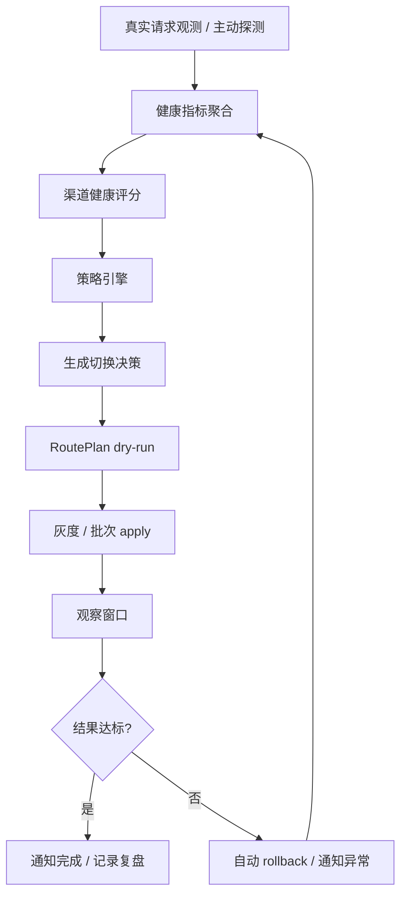

# 健康驱动自动切换方案

本文档描述 E2M 的“健康驱动自动切换”能力设计，用于把平台托管上游从“可发布、可回滚”推进到“可观测、可决策、可自动运营”。

核心目标是解决站长管理自己站点时最痛的上游波动问题：站长不再需要持续盯渠道、手动试错、临时改路由；上游池、渠道状态、发布计划、切换策略、通知复盘由 E2M 平台统一托管。

## 产品定位

E2M 的托管上游能力应形成一个清晰的产品承诺：

- 平台统一管理全平台共享的上游目录、Key 分配和来源质量；第一版默认对所有用户开放，不接入订阅或退订流程。
- 站长使用平台自动分配的 Key，而不是逐个挑选底层渠道；每个用户在一个上游来源下至多持有一个专属 Key。
- 当上游波动时，平台自动判断、灰度切换、观察回滚、通知站长。
- 质量切换只在该用户已经分配、且来自不同上游来源的 Key 之间进行，不重新分配 Key，也不创建暖备。
- 普通用户的健康视图只显示容量、5 分钟事实 SLA、匿名故障、恢复进度和切换结果，不在该视图暴露来源、渠道、模型、远端账号或 Key。

健康驱动自动切换不是单点规则，而是一套闭环：



## 设计原则

1. 自动切换不绕过现有发布引擎。

   自动决策只生成“切换意图”，真实执行必须复用现有 `RoutePlan + reconcile` 能力，包括 dry-run、apply、rollback、`PublishedBinding`、灰度、批次发布、通知和审计。

2. 第一版采用可解释的扣分模型。

   每个具体下游对一把 Key 的质量作用域从 100 分开始，只因可归责于上游的错误、首字耗时和总耗时扣分。来源级聚合只能提供软信号，第一版不把成本或计费纳入质量决策。

3. 切出去可以快，切回来必须慢。

   故障撤出要及时；恢复必须经过冷却和连续主动探测，不能因时间经过或被动指标好转直接回归。

4. 调度与 Key 分配解耦。

   质量调度只启停当前用户已经分配的 Key，不改变归属、不领取新 Key、不创建暖备。第一版暂不接入计费或成本优化。

5. 调度故障必须局部止损，资源生命周期与质量调度保持解耦。

   质量调度不会触发 create/delete/deprovision。平台管理员发起的
   Connector v2 生命周期流程可以创建、更新和退役平台账号；退役先
   disable，再由持久任务于 30 分钟后删除。用户自有账号只能更新。
   无健康的不同来源替代 Key 时，平台立即停止当前下游实例的故障
   Binding，使该实例 fail-closed；不会修改共享渠道目录，也不会连带
   摘除其他下游。

6. 来源质量不是全平台总开关。

   超时、限流、服务端错误、网络错误和来源容量压力都属于软质量信号。它们只能通过稳定的下游 cohort 逐步扩大影响面，不能因一个 provider/source 聚合结论一次摘除所有用户。

## 现有能力复用

健康驱动自动切换应构建在当前托管上游能力之上：

- `UpstreamPool`：平台托管、默认向全平台用户开放的上游目录。
- `UpstreamChannel`：池内一把可分配 Key；`source_id` 标识其稳定上游来源。
- `RoutePlan`：平台为某个站点/实例交付共享目录后的期望路由状态，不代表第一版存在订阅关系。
- `PublishedBinding`：计划渠道和真实网关账号之间的绑定记录。
- reconcile：对比期望状态和真实网关状态，生成 create / update / enable / disable / revoke / hold / noop 等动作。
- dry-run：切换前预演影响。
- apply：执行发布动作。
- rollback：回滚发布结果。
- rollout：支持 immediate / canary / batched。
- notify router：面向飞书、QQ、webhook 等通知通道。

自动切换层不要直接调用网关接口修改账号或渠道，而应生成一个标准决策，再交给发布引擎执行。候选集仅包含已归属当前用户的 Key；替代项必须与故障 Key 的 `source_id` 不同。调度不会临时领取新 Key、变更 Key 归属或创建所谓“新暖备”。

## 指标采集

服务质量从业务视角主要绑定三项指标：

- 成功率：请求是否稳定完成。
- 首字延迟：用户是否感觉“卡住”。
- 总耗时：完整响应是否足够快。

指标来源分为两类。

### 被动观测

来自真实业务请求：

- 请求是否成功。
- HTTP 状态码 / 网关错误码。
- 首字延迟，TTFT / first token latency。
- 总耗时。
- 请求模型。
- 上游渠道 ID。
- 网关实例 ID。
- token 用量。
- 成本估算。
- 是否超时。
- 是否限流。
- 是否余额不足。
- 是否认证失败。

### 主动探测

由平台定时发起：

- 小 prompt 可用性探测。
- 指定模型探测。
- 低频延迟探测。
- 认证有效性探测。
- 余额 / 额度探测。
- 来源状态探测，但结论仍须落到具体下游 Binding，不能作为全平台摘除开关。

两类数据都需要。只靠被动观测会有冷启动和样本偏差；只靠主动探测不能完全代表真实用户体验。

客户端参数错误和请求取消可以作为原始 observation 留存，但不进入上游成功率、错误率、风险分或质量置信度。`sample_count` 只统计可归责于上游的质量样本。

恢复证据比普通可用性检查更严格。一次成功主动探测必须同时具有 2xx、`error_type=none`、有效的 `first_token_ms` 和 `total_ms`，并满足 `0 < first_token_ms <= total_ms`；只有“接口可达”而没有完整延迟证据不能恢复调度。

## 建议数据结构

### ChannelObservation

```text
ChannelObservation
- id
- channel_id
- instance_id
- pool_id
- model
- success
- status_code
- error_type
- first_token_ms
- total_ms
- input_tokens
- output_tokens
- estimated_cost
- source: passive | probe
- observed_at
```

### ChannelHealthSnapshot

```text
ChannelHealthSnapshot
- id
- channel_id
- pool_id
- instance_id
- window
- sample_count
- success_rate
- ttft_p50
- ttft_p95
- duration_p50
- duration_p95
- error_rate
- timeout_rate
- rate_limit_rate
- estimated_cost_per_1k_tokens
- health_score
- quality_score
- success_score
- ttft_score
- duration_score
- stability_score
- cost_score
- risk_score
- health_state
- created_at
```

### RouteStrategy

```text
RouteStrategy
- id
- name
- type: stability_first | cost_first | latency_first | balanced
- thresholds
- weights
- auto_apply
- approval_required
- cooldown_seconds
- recovery_observation_seconds
- max_auto_switches_per_hour
```

### AutoSwitchDecision

```text
AutoSwitchDecision
- id
- plan_id
- instance_id
- pool_id
- strategy
- trigger_reason
- from_channel_id
- to_channel_id
- disabled_channels
- enabled_channels
- held_channels
- risk_level
- dry_run_result
- status: proposed | skipped | applied | observing | rolled_back | failed | completed
- created_at
- applied_at
- finished_at
```

### ReconcileRun

```text
ReconcileRun
- id
- plan_id
- dry_run
- action_source: manual | auto_switch | rollback
- actions
- status
- error
- started_at
- finished_at
```

`ReconcileRun` 是自动化运营的基础表。没有它，就很难回看每次 dry-run、apply、rollback 的动作、结果和失败原因。

## 聚合窗口

建议按多个窗口聚合：

- 1 分钟窗口：快速发现突发故障。
- 5 分钟窗口：作为自动切换主依据。
- 30 分钟窗口：判断稳定性趋势。
- 24 小时窗口：用于成本、长期质量和策略复盘。

第一版可以先落地 1 分钟和 5 分钟窗口。

## 质量扣分

第一版的调度依据是一个单向扣分模型。每个具体下游对一把 Key 的质量作用域在窗口开始时为 100 分，只计算以下三类扣分；同一来源在不同下游的 circuit 仍彼此独立：

```text
quality_score = 100
  - upstream_error_penalty  # 最多 55 分
  - ttft_p95_penalty        # 最多 25 分
  - duration_p95_penalty    # 最多 20 分
```

- 上游责任错误包含 timeout、rate-limit、server、network 等可归责于上游的错误；达到配置的错误预算时扣满 55 分。
- p95 首字耗时从上限的 20% 开始线性扣分，达到上限时扣满 25 分。
- p95 总耗时从上限的 20% 开始线性扣分，达到上限时扣满 20 分。
- 样本未达到默认最小数量时，三项扣分按证据比例缩放；空窗口仍为 100 分，不把“没有流量”误判成故障。
- 默认 `quality_score <= 60` 进入摘除流程；高于 60 的已分配候选按剩余分从高到低选择。
- 客户端参数错误和请求取消不扣分，也不增加质量证据。

认证失败、余额不足是唯一绕过分数和 cohort 的自动硬故障，而且必须具有具体实例/Binding 证据：平台立即停止受影响下游的该 Key，不扩大到其他用户。平台维护或退休状态也不参与调度，但属于人工生命周期控制，不应伪装成质量摘除。

连续普通错误、低成功率、p95 首字超限、p95 总耗时超限，以及来源/provider 容量压力都不是全局硬门槛。它们只作为上述扣分或来源级软信号，达到摘除分后仍走 25% -> 50% -> 75% 的稳定 cohort，绝不一次全平台摘除。

## Binding 状态机

质量隔离不是一个来源/provider 的全局状态。每个 `(plan_id, channel_id)` 下游 Binding 独立维护以下运行态：

```text
healthy
degraded
unhealthy
quarantined
recovering
```

状态转移：

```text
healthy -> degraded
- 5 分钟成功率下降
- p95 首字延迟超过阈值
- p95 总耗时超过阈值

degraded -> unhealthy
- 连续多个窗口未恢复
- 连续失败超过阈值
- timeout、rate-limit、server、network 或容量压力持续消耗质量分
- 认证失败、余额不足仅让具有明确证据的实例立即进入摘除

unhealthy -> quarantined
- 已被自动撤出调度
- 暂停参与主路由

quarantined -> recovering
- 冷却结束后主动探测通过
- 被动指标不能打开隔离态

recovering -> healthy
- 连续 3 次主动探测达到恢复分（默认 85）
- 恢复原 Binding 时保留当前健康来源在线
```

运行态按 `(plan_id, channel_id)` 持久化为 `closed / open / half_open`。`open` 和 `half_open` 都不承载正常流量；半开仅表示主动探测进度，不是用户流量灰度。首次冷却默认 5 分钟，探测失败按指数退避，最长 1 小时。冷却到期只意味着允许发起探测，时间流逝本身不能让 Key 回归。

## 候选选择

当前自动切换以质量扣分为准，不做“同一个上游内挑另一把 Key”，也不在故障时领取新资源。每个用户每个 `source_id` 只有一个永久归属 Key；一个 Key 只能归属一个用户，停用、撤销或隔离都不会释放给其他用户，恢复时可重新给原用户启用。

调度候选必须同时满足：

- Key 已归属当前计划的用户，且 Binding 已发布。
- Key 的 `source_id` 与被摘除 Key 不同。
- 质量分高于摘除线，且 circuit 未处于 `open / half_open`。
- 平台状态不是维护或退休。

历史 `stability_first`、`cost_first`、`latency_first` 和 `balanced` 类型仍可作为策略配置兼容层，但第一版摘除与替代选择均遵守同一扣分和不同来源约束；暂不以计费或成本改变候选结果。

自动动作固定为：当前 Key 质量分达到摘除线后，从用户已分配的其他来源 Key 中选择最高分候选；替代 Key 与故障 Key 在同一次调度意图中启用/停用，经过 dry-run 和风险保护。故障 Key 只能通过主动探测恢复，回归时不关闭当前健康来源。

## 自动切换执行流程

自动切换流程：

1. 聚合健康快照。
2. 更新渠道状态机。
3. 策略引擎筛选候选渠道。
4. 生成 `AutoSwitchDecision`。
5. 生成 `RoutePlan` 变更意图。
6. 执行 reconcile dry-run。
7. 进行风险分级。
8. 低风险自动 apply；计划内新 Binding 仍受 canary / batched rollout 保护。
9. 中风险进入审批或只做灰度。
10. 高风险只通知，不自动执行。
11. apply 后进入观察窗口。
12. 观察达标后完成并通知复盘。
13. 观察不达标则自动 rollback 并通知。

软质量故障不会一次性摘除所有下游。平台使用 `(plan_id, channel_id)` 稳定哈希，在连续坏的 5 分钟窗口中按 `25% -> 50% -> 75%` 扩大 cohort，且不会自动扩大到 100%。同一批下游会稳定保留在后续批次中，未进入当前 cohort 的下游继续承载并提供对照观测，避免容量型波动触发同时迁移和流量踩踏。认证、余额等有明确实例证据的硬故障只摘当前实例并绕过 cohort。每个下游独立保存 circuit，因此一个实例的短期容量压力不会变成全平台总开关。

`applying` 是有版本的分布式执行租约。初次 apply、观察判定和崩溃修复均以数据库时间领取两分钟租约，实际工作最多运行一分钟；每个网关/Binding 动作、circuit 写入和最终决策提交前都必须续租并校验 `lease_version`。旧 Core 超时后不能继续执行下一步、补偿动作或覆盖新 owner。Connector 调度写任务同时携带同一决策作用域和代次，晚到的低代次任务会在本地网关写入前被拒绝。升级前遗留的无租约 `applying` 行由迁移以数据库时间补两分钟 grace，避免节点时钟偏差导致误接管。

Runner 独立于正常 published 计划评估扫描过期执行。若计划已经 suspended，修复只允许对 `from/to` 执行全 `false` drain 并终结决策；每个实际动作前再次确认计划仍为 suspended，避免并发重新发布后被旧修复任务摘除。执行一旦可能创建 durable Connector 任务，错误路径不提前释放租约，而等待自然到期。

跨下游 cohort 与 `RoutePlan.rollout` 是两套独立保护：前者决定哪些下游现在执行软摘除，后者决定一个计划内新 Binding 如何发布。只有已进入当前 cohort 或发生实例级硬故障的下游才执行切换；此时若没有健康的不同来源 Key，立即 disable 当前故障 Binding 并 fail-closed，普通切换 cooldown 和每小时限频不得阻止止损。

恢复流程独立于替代来源调度：

1. Runner 扫描到期的 `open / half_open` circuit。
2. 通过版本 CAS 延后 `probe_after`，只有抢占成功的 Runner 能创建探测任务。
3. Connector 执行 `gateway.account.quality.probe`，拿到结果后先持久化私有 durable outbox、再上报 observation、最后完成任务。物理探测是 at-least-once：若进程恰好在真实请求返回与 outbox 落盘之间崩溃，可能再次请求上游；稳定 observation ID 保证 Core 只计一次证据。实现真实适配器时还需使用网关原生幂等能力或探测频控限制额外成本。
4. 第一次高分探测进入 `half_open`，之后每分钟继续探测。
5. 连续 3 次得分不低于 85 后标记 `recovery_ready`，进入独立的跨下游恢复调度，不直接全量启用。
6. 恢复按稳定哈希 `10% -> 25% -> 50% -> 100%` 扩大。每阶段至少观察 5 分钟，并要求阶段开始后已回归成员产生真实被动流量且达到最小样本数；证据不足保持当前阶段。
7. 任一已回归 Binding 的真实流量分低于 85 或再次满足摘除条件，立即重新隔离；探测失败也重新 `open` 并指数退避。Connector 离线或不支持探测时继续隔离，绝不伪恢复。

当前只有 Sub2API Adapter 支持自动主动恢复：Connector 本地必须显式开启质量探测，并配置持久化的每小时预算和最小请求间隔。探测使用指定账号的 SSE 测试入口，按渠道配置的 `capability + endpoint_path` 取得结构化错误、真实 TTFT 和总耗时。NewAPI 缺少真实 TTFT，CPA 缺少安全的账号级探测入口，因此二者明确显示“需人工恢复”，不广告自动探测能力。任何不支持、未开启、超预算或证据不完整的情况都保持隔离，不能把普通可用性检查伪造成健康证据。

建议风险分级：

```text
低风险
- 有已分配、不同来源且健康的替代 Key
- 只影响单个计划或小流量
- dry-run 只包含 enable / disable / hold / noop
- 当前计划已有 rollback 基线

中风险
- 涉及多个渠道权重变化
- 替代来源样本较少
- 需要扩大批次

高风险
- 需要 create / deprovision / delete
- 认证失败或余额不足范围不清
- dry-run 出现不可解释动作
- 每小时切换次数超过上限
```

“无健康替代 Key”不走上述高风险不执行规则：继续使用已确认故障的 Key 会掩盖故障，因此当前下游直接 fail-closed，并记录 L3 决策、告警和后续恢复探测。

## 防抖与保护

自动切换必须具备保护机制：

- 单实例最小切换间隔，例如 10 分钟。
- 每小时最大自动切换次数。
- 普通替代切换受冷却和限频保护；实例级硬故障及无健康替代时的 fail-closed 绕过防抖。
- 质量调度不自动触发 delete/deprovision；管理员生命周期流程与质量调度分离。
- 同一渠道故障期间不重复生成等价决策。
- 手动维护状态优先级高于自动策略。
- 回滚失败时立即升级通知。

## 通知设计

通知的重点不是“系统做了什么底层操作”，而是告诉站长：为什么切、影响什么、现在状态如何。普通用户通知不出现渠道名、来源名、模型、远端账号或 Key；平台管理员的审计记录可以保留这些定位字段。

自动切换通知：

```text
【E2M 上游自动切换】
站点：xxx
原因：一个服务来源质量分降至 58，5 分钟成功率为 91.4%，p95 首字耗时为 4200ms
动作：已暂停该来源，并切换到另一已分配来源
影响：当前仍有 2 个来源可调度，正在观察
结果：3 分钟后发送复盘
```

复盘通知：

```text
【E2M 上游切换完成】
站点：xxx
结果：成功
成功率：91.4% -> 99.1%
p95 首字延迟：4200ms -> 1300ms
p95 总耗时：18s -> 8s
当前容量：2 个来源可调度，1 个来源隔离恢复中
```

回滚通知：

```text
【E2M 上游切换回滚】
站点：xxx
原因：替代来源观察窗口未达标
动作：已回滚至上一发布状态
建议：平台将继续隔离异常渠道并观察恢复
```

## 控制台能力

控制台按角色分成两个视图。

平台管理员在“上游托管”中查看和操作：

- 共享目录、`source_id`、Key 永久归属和 Binding 状态。
- 当前质量分及错误、首字、总耗时三项扣分。
- `quality_below_threshold`、实际 Binding 状态和 durable circuit 状态；不能只因分数低或人工停用就显示为“已质量摘除”。
- circuit 的 `probe_after`、连续成功探测数、最后分数、最后原因和恢复状态。
- 最近 `AutoSwitchDecision`、`ReconcileRun`、dry-run、rollback 和通知记录。

平台管理员还可在 `/operations-center` 使用统一运维视图查看来源健康矩阵、证据新鲜度与置信度、未知状态、扣分证据、影响下游与请求量、摘除 cohort、当前路由、Connector 恢复方式、`10% -> 25% -> 50% -> 100%` 回归阶段、恢复倒计时、网关回执和完整时间线。没有新鲜证据时必须显示“未知”，NewAPI / CPA 等不具备完整主动探测证据的适配器显示“需人工恢复”，不得显示为 100% 健康。

普通用户在 `/pool-health` 只查看：

- 容量：已发布、可调度、隔离恢复中的来源数量。
- 最近 5 分钟事实 SLA：实际请求成功率、p95 首字耗时、p95 总耗时、样本数和更新时间。
- 匿名故障状态与主动探测恢复进度。
- 脱敏后的切换结果和时间。

普通用户接口为 `GET /api/v1/owner/pool-health`。该响应不返回 pool/plan/instance/channel/source/remote/model 标识，不返回 Key 或决策 dry-run；其事实 SLA 使用最近 5 分钟原始请求，包括客户端错误和取消，与排除这些样本的上游质量扣分口径有意不同。

## MVP 范围

第一版形成以下清晰闭环：

1. 记录 `ReconcileRun` 历史。
2. 采集三项核心指标：成功率、首字延迟、总耗时。
3. 每分钟生成 `ChannelHealthSnapshot`。
4. 从 100 分开始计算错误 55、首字 25、总耗时 20 三类扣分，默认 `<=60` 触发摘除流程。
5. 对软质量故障按稳定 `25% -> 50% -> 75%` 下游 cohort 扩大，不提供 provider/source 全平台摘除开关。
6. 只在当前用户已分配且来源不同的 Key 之间切换，Key 不共享、不复用，不创建暖备。
7. 自动切换经过 dry-run；低风险执行 apply 并观察，不达标执行受控回滚。
8. 无健康替代时立即停止当前下游故障 Binding，进入 fail-closed。
9. 持久化 `(plan_id, channel_id)` circuit，只以主动探测推进恢复。
10. 接入飞书 / QQ / webhook 通知，并提供普通用户脱敏健康视图。

第一版不做：

- 由质量调度自动触发 delete/deprovision；管理员发起的 Connector v2 生命周期退役流程仍可执行。
- 订阅、退订和计费。
- 复杂机器学习预测。
- 多目标动态权重学习。
- 大范围无审批全量切换。
- 同一来源内轮换 Key、故障时自动领取新 Key或创建暖备。

## 实现现状与后续顺序

当前代码已经具备以下基础闭环：

- `ChannelObservation`、1 分钟/5 分钟 `ChannelHealthSnapshot` 和事实指标聚合。
- 100 分扣分、默认摘除线、稳定 cohort、不同 `source_id` 替代约束和无替代 fail-closed。
- `AutoSwitchDecision`、`ReconcileRun`、dry-run/apply/观察/rollback、幂等和持久化 circuit。
- 数据库时钟租约、递增代次、逐动作 fencing、暂停计划独立修复和 Connector 晚到任务防护。
- typed L0 主动探测任务、CAS claim、durable outbox、稳定 observation ID、冷却/指数退避/连续三次恢复。
- Sub2API 真实 SSE 主动探测、本地显式开关、持久化预算/限流，以及按 `capability + endpoint_path` 隔离证据。
- `10% -> 25% -> 50% -> 100%` 稳定恢复 cohort、阶段观察和被动流量回归保护。
- Key 永久归属：一个用户每个来源一个 Key，停用、撤销和隔离都不释放给其他用户。
- 统一管理员运维中心，以及普通用户的容量、5 分钟事实 SLA、匿名故障恢复和脱敏切换结果。

后续开发按以下顺序收口：

1. 为 NewAPI 和 CPA 补齐无副作用、账号级、结构化且具有真实 TTFT/总耗时的主动质量探测接口；补齐前继续要求人工恢复。Sub2API 保持显式开关、预算和限流边界。
2. 对生产故障注入持续验证远端网关写成功、Binding/circuit 持久化前进程崩溃的自动修复，并为 applying 租约/Connector fence 建立运行告警。
3. 完善管理员对 `quality_below_threshold`、Binding、circuit、探测进度和恢复原因的分层展示。
4. 完善普通用户 5 分钟事实 SLA 与匿名通知的时间序列和复盘，但保持字段脱敏合同。
5. 只有业务重新确认后才评估订阅、退订、计费或成本优化；不得把它们默认混入质量调度。

## 验收标准

### 产品验收

- 站长无需手动维护上游渠道即可获得托管切换能力。
- 自动切换原因、动作、结果都能被通知和回看。
- 质量分从 100 开始，只由上游责任错误、首字和总耗时扣分，客户端错误与取消不污染质量。
- 一个来源质量下降时，只切换到当前用户已分配的不同来源 Key，不变更归属或创建暖备。
- 软故障按稳定 cohort 扩大且永不一次全平台摘除；实例级认证/余额故障只影响有证据的 Binding。
- 普通用户健康视图只能看到容量、5 分钟事实 SLA、匿名故障恢复和脱敏切换结果。
- 隔离来源不会因时间经过或被动流量自动回归；三次主动探测达标后也必须按 `10% -> 25% -> 50% -> 100%` 分阶段恢复。

### 工程验收

- 自动切换不直接绕过 reconcile 修改网关。
- 每次 dry-run / apply / rollback 都有 `ReconcileRun` 记录。
- 每次自动切换都有 `AutoSwitchDecision` 记录。
- 普通替代切换有冷却时间、观察窗口和最大频率限制；硬故障和无替代 fail-closed 不被防抖阻止。
- create/delete/deprovision 等资源生命周期高风险动作不会由质量调度自动执行；管理员生命周期流程仍必须执行 ownership、幂等、fence、回执和审计约束。
- apply 后观察不达标会自动 rollback。
- 后端测试覆盖扣分、cohort、不同来源、状态机、防抖、fail-closed、主动恢复、dry-run、apply 和 rollback。
- 管理员视图区分质量越线、Binding 状态和 circuit 状态；普通用户视图满足脱敏合同。
